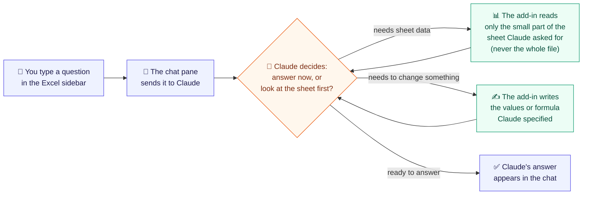

# Crunched KISS

An Excel task-pane agent for a four-hour take-home. You chat in the pane; Claude asks for workbook tools; Office.js is the only Excel runtime. Large sheets stay usable because the model sees addresses and samples, never a whole used range.

## Setup on a Mac

Prerequisites: Node 20–24, Python 3.12+, desktop Excel (Microsoft 365 / 16.x), and either [mkcert](https://github.com/FiloSottile/mkcert) or Microsoft’s `office-addin-dev-certs` (the setup script uses whichever is present).

```bash
# 1. API key at the repo root (never commit this file)
cp .env.example .env
# Edit .env and set ANTHROPIC_API_KEY=sk-ant-...

# 2. Trusted certs for Excel’s WebView (HTTPS only)
./scripts/setup-certs.sh

# 3. Backend — plain HTTP on 127.0.0.1:8000, no certificate flags
cd backend
python3 -m venv .venv && source .venv/bin/activate
pip install -r requirements.txt
cd ..
./scripts/dev-backend.sh

# 4. Add-in (second terminal)
cd frontend
npm install
npm run dev-server

# 5. Sideload into desktop Excel (third terminal, frontend/)
npm start
```

If `npm start` does not attach the pane, copy the manifest and restart Excel:

```bash
mkdir -p ~/Library/Containers/com.microsoft.Excel/Data/Documents/wef/
cp frontend/manifest.xml ~/Library/Containers/com.microsoft.Excel/Data/Documents/wef/
```

Then **Insert → Add-ins**, or look for **Crunched** on the Home tab.

The pane talks only to `https://localhost:3000`. Webpack proxies `/api/*` to the HTTP backend. Do not point Excel at port 8000.

## How it works (plain-language)



In short: you never hand Claude the spreadsheet file. You ask a question in the sidebar; Claude looks at only the small pieces of the sheet it actually needs (a sheet list, one range, a search result), reasons about them, optionally writes a value or formula back, and replies in plain English. This back-and-forth can repeat a few times per question, capped at 8 rounds so it can't loop forever. Every step Claude takes shows up as a small card in the thread, so nothing happens invisibly. That's also why it works on a spreadsheet with a million cells just as well as a small one — Claude is never shown more than a few thousand cells at a time.

## Architecture (technical)

```
Excel WebView  https://localhost:3000
  Chat UI  →  runAgent()  →  excel.ts (Office.js)
       │ fetch /api/chat
       ▼
webpack (HTTPS, trusted)  ──proxy──▶  uvicorn :8000 (HTTP, localhost)
                                          │
                                          ▼
                                    Anthropic tool-use
```

The agent loop lives in the pane because tools can only run inside Excel’s WebView. The backend is one stateless Claude turn: it returns `tool_calls` or a final `message`. There is a single HTTPS origin so the WebView does not need a second trusted certificate or CORS to uvicorn.

## Tools

Each executed tool stays in the thread as a card (its name and a short result), so the demo can point at `list_workbook_meta` or `write_range` without opening the network tab.

| Tool | Role |
|---|---|
| `list_workbook_meta` | Sheet names, used-range addresses, dimensions, and a first-row header preview |
| `read_range` | Values and formulas for one address; capped at 2,000 cells |
| `write_range` | Write a 2D values array; validated before `Excel.run` |
| `get_selection` | Active range plus a small preview |
| `find` | Locate a label; at most 50 addresses |

Hard cap: **8 tool rounds** per user send, then `force_text`.

## Any workbook size

The model never loads the book. It asks for **addresses and samples**.

- Call `list_workbook_meta` first (O(sheets), not O(cells)).
- Use `find` to locate labels, then `read_range` on a small block.
- Reads over 2,000 cells are truncated (or rejected) in the pane.
- After 8 tool rounds the pane forces a text reply.
- Generate a ~1M-cell fixture with `python3 scripts/make_big_workbook.py`. The xlsx is local and gitignored.

## Tests

```bash
cd backend && .venv/bin/pytest -q
cd frontend && npm test
```

These cover the HTTP contract, tool schemas, cell/history caps, and API paths. Office.js and the React pane only run inside Excel, so they are hand-checked in the live demo rather than mocked.

## What was cut

- Multi-tier Claude Code orchestrator as this product
- LangGraph, streaming, conversation persistence, auth, Vercel
- Reason / Agent Mode toggles
- Write-confirm dialogs (first real-user follow-up, not the interview bar)
- Excel Online as the primary host

## 15-minute demo

A walkthrough that has been run end to end against the 1,000,000-cell fixture. Every observation below is what the pane actually shows.

### Before the call

```bash
# Fresh fixture: the demo writes to it, so regenerate to restore the planted errors
python3 scripts/make_big_workbook.py
open scripts/big.xlsx
```

Start the backend and dev server as in Setup, then open **Crunched** on the Home tab. The empty pane offers the three prompts below as buttons, so you can drive the whole demo without typing.

`Budget` is six rows carrying two deliberate mistakes: `D4` is a hard-coded `1000` where its neighbours are formulas, and the `Per unit` row divides by empty cells, giving `#DIV/0!`. `Data` is 5,000 × 200.

### 1. A million cells, one call (about 2 minutes)

Ask **"How big is this workbook?"**

One `list_workbook_meta` card appears, reading `Data 5000×200 · Budget 6×4`, followed by a table:

| Sheet | Used Range | Rows | Columns |
|---|---|---|---|
| Data | A1:GR5000 | 5,000 | 200 |
| Budget | A1:D6 | 6 | 4 |

**The point:** one metadata call answered a question about a million cells. There is no `read_range` card, because nothing read the Data sheet. Metadata is O(sheets), not O(cells), so this is as fast on a large book as a small one.

### 2. Finding the error (about 4 minutes)

Ask **"Check the Budget sheet for errors."**

Claude locates the labels, reads the small block with formulas, and reports the hard-coded `Budget!D4` and the `#DIV/0!` row.

**The point:** the `read_range` card is tagged `· formulas`. Error-checking a model needs the formula behind the number, not the number, and a hard-coded value where its neighbours compute is exactly the class of bug this catches.

### 3. Fixing it (about 3 minutes)

Ask **"Fix the hard-coded Gross profit in Budget!D4."**

Four cards appear in order, which is the whole architecture on one screen:

| Card | Shows |
|---|---|
| `list_workbook_meta` | `Data 5000×200 · Budget 6×4` |
| `find` | `"Gross profit" · 1 match` |
| `read_range` | `Budget!A1:D6 · formulas` |
| `write_range` | `Budget!D4` |

Claude replies that `Budget!D4` now holds `=D2-D3`. Click `D4` in the sheet: the formula bar confirms it, next to the genuine `=B2-B3` and `=C2-C3`.

**The point:** `find` means the model never scans to locate a label, and the write is a formula rather than a pasted number, so the model stays live.

Select a few cells anywhere and the pill above the composer reads **"Crunched can see Data!L1:N6 · 6 rows × 3 columns"**. Say "this selection" in a question and that is the range Claude gets.

### 4. The code (about 4 minutes)

Three files, in this order:

- `frontend/src/app/services/agentClient.ts` — the loop. It calls the backend, runs whatever tools come back, feeds results in, repeats. Capped at 8 rounds, then forces a text reply.
- `backend/app/agent.py` — one stateless Claude turn. No session, no graph, no memory of its own.
- `backend/app/tools.py` — the closed tool list, and the 2,000-cell policy that keeps a huge sheet from ever reaching the model.

**The point:** Excel never lives in Python. Tools can only run inside Excel's WebView, so the loop lives where the tools are, and the backend stays a pure function that is trivial to test with a mocked client.

### 5. What is missing, and why (about 2 minutes)

See **What was cut** above. The one worth naming aloud is the write-confirm dialog: writes apply immediately today. For a real user editing a live model that is the first thing to add, and it was cut deliberately rather than overlooked.

## Time log

Honest, short: Hour 1 was sideload + HTTPS. Hour 2 was chat UI and Office.js wrappers. Hour 3 was the FastAPI tool-use contract and tests. After that: one-origin `/api` proxy (#2), then this README (#5) while #3/`find` and #4/fixture land on other worktrees.

## Layout

- `frontend/` — Office add-in. `excel.ts` is the only Office.js wrapper.
- `backend/app/agent.py` — the only LLM call.
- `backend/app/tools.py` — closed tool list and the 2,000-cell policy.
- `certs/` — webpack HTTPS pair (gitignored). Uvicorn is HTTP on localhost.
