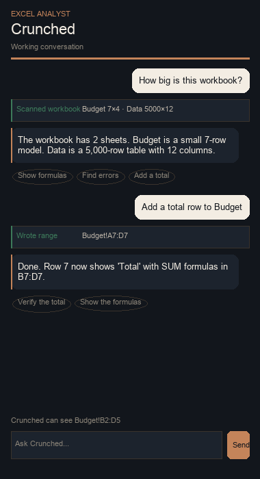
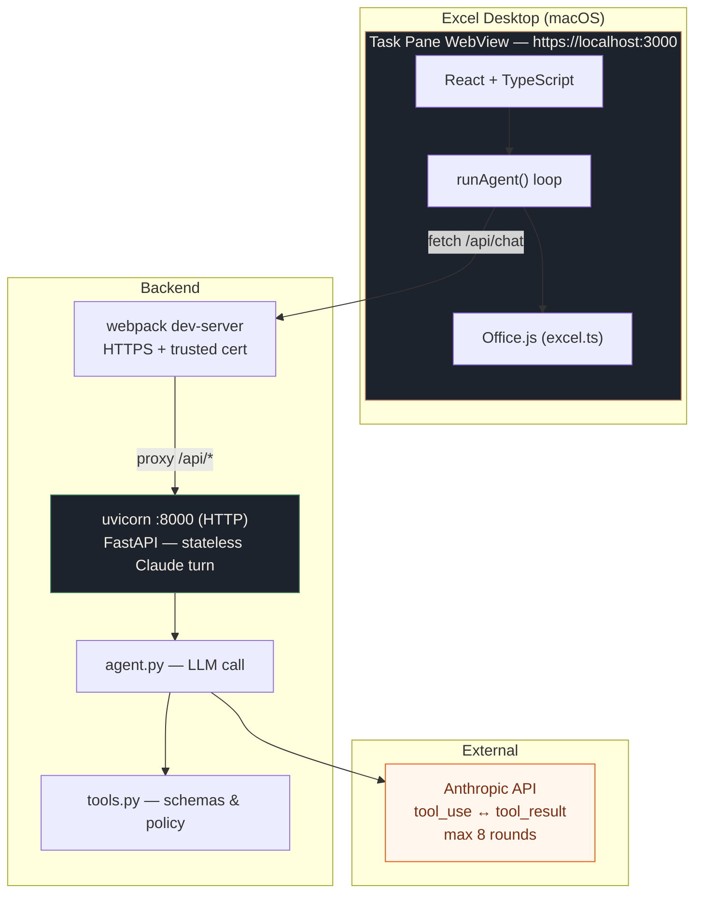

# Crunched KISS

An Excel task-pane agent for a four-hour take-home. You chat in the sidebar; Claude asks for workbook data through tools; Office.js is the only Excel runtime. Large sheets stay usable because the model sees addresses and samples, never a whole used range.

**Key idea:** The AI never holds the spreadsheet. It requests small pieces (a sheet list, one range, a search result), reasons about them, optionally writes back, and replies in plain English. This works on a 1-million-cell workbook as well as a small one — Claude is never shown more than a few thousand cells at a time.



---

## Features

- **Chat interface** inside Excel's task pane — ask questions in natural language
- **Tool-use loop** — Claude reads, searches, and writes cells through structured tools
- **Tool visibility** — every Excel operation appears as a card in the chat thread so nothing happens invisibly
- **Write confirm + undo** — Apply / Don't write before a cell changes; Undo restores the last snapshot
- **Large-sheet safe** — reads are capped at 2,000 cells; metadata is O(sheets), not O(cells)
- **Live selection** — the pane shows your current Excel selection so you can say "this table"
- **8-round cap** — per-question tool loop hard-limits at 8 rounds, then forces a text answer

> 📋 See the full [feature list](docs/FEATURES.md) for a complete inventory of shipped, planned, and cut features.

---

## Prerequisites

- **macOS** with Apple Silicon or Intel (tested on macOS 14+)
- **Node.js 20–24** and **npm 9–11**
- **Python 3.12+**
- **Microsoft Excel** desktop (Microsoft 365 / 16.x) — the add-in sideloads into desktop Excel only
- **Anthropic API key** (Claude Sonnet or Haiku)
- Either [**mkcert**](https://github.com/FiloSottile/mkcert) or Microsoft's `office-addin-dev-certs` (the setup script uses whichever is present)

---

## Setup (3 terminals)

### Terminal 1 — Environment & Certs

```bash
# Clone and enter the repo
cd crunched-kiss

# Create your API key file (never commit this)
cp .env.example .env
# Edit .env and set:
#   ANTHROPIC_API_KEY=sk-ant-api03-...
#   ANTHROPIC_MODEL=claude-sonnet-4-6   (or claude-sonnet-5-1)

# Generate trusted HTTPS certificates for Excel's WebView
./scripts/setup-certs.sh
```

> **Why HTTPS?** Excel's WebView requires a trusted origin. Webpack serves the pane on `https://localhost:3000`. The backend itself is plain HTTP on `127.0.0.1:8000` — no cert flags needed there.

### Terminal 2 — Backend

```bash
cd backend
python3 -m venv .venv && source .venv/bin/activate
pip install -r requirements.txt
cd ..
./scripts/dev-backend.sh
```

The backend starts on `http://127.0.0.1:8000`. It exposes one endpoint:

| Endpoint | Purpose |
|---|---|
| `POST /api/chat` | One Claude turn — returns `tool_calls` or a `message` |

### Terminal 3 — Frontend & Excel

```bash
cd frontend
npm install
npm run dev-server   # https://localhost:3000 with HMR
```

In a **fourth** terminal (or after `dev-server` is up):

```bash
cd frontend
npm start            # sideloads into Excel
```

Look for **Crunched** on Excel's Home tab, or go to **Insert → Add-ins → My Add-ins**.

---

## Troubleshooting

| Problem | Fix |
|---|---|
| `npm start` does not show the pane | Copy the manifest manually: `mkdir -p ~/Library/Containers/com.microsoft.Excel/Data/Documents/wef/ && cp frontend/manifest.xml ~/Library/Containers/com.microsoft.Excel/Data/Documents/wef/` then restart Excel. |
| `NET::ERR_CERT_AUTHORITY_INVALID` in Excel | Re-run `./scripts/setup-certs.sh` and trust the generated cert in Keychain Access (Always Trust). |
| Backend says `ANTHROPIC_API_KEY is not configured` | Check `.env` exists at repo root and `ANTHROPIC_API_KEY` is set (not commented). |
| `Module not found` on `npm run dev-server` | Run `npm install` again; some devDependencies may have failed on first install. |
| Excel shows a blank pane | Open Safari → Develop menu → inspect the WebView. Check the console for CORS or cert errors. |
| Changes don't appear after git pull | The add-in caches aggressively. Click the `...` on the task pane → **Reload**, or restart Excel. |

---

## Architecture



**Why stateless?** The backend holds no conversation state. The pane sends the full message history each time. This means you can restart the backend mid-chat and nothing breaks.

**Why single-origin?** Webpack proxies `/api` to uvicorn, so the WebView talks to one HTTPS origin. No CORS headers, no second trusted certificate, no `Access-Control-Allow-Origin` gymnastics.

---

## Tools

Each tool the model uses becomes a visible card in the chat thread, so the demo can point at `list_workbook_meta` or `write_range` without opening the network tab.

| Tool | What it does | Limit |
|---|---|---|
| `list_workbook_meta` | Sheet names, used-range addresses, dimensions, header preview | O(sheets), not O(cells) |
| `read_range` | Values and formulas for one address | 2,000 cell cap |
| `write_range` | Writes a 2D array back to the sheet | Validated before `Excel.run` |
| `get_selection` | The user's currently selected range | Small preview only |
| `find` | Locate a label by text search | Max 50 addresses |

**Hard cap:** 8 tool rounds per user message, then the pane forces a text-only reply.

---

## Development

```bash
# Backend tests (pytest)
cd backend && .venv/bin/pytest -q

# Frontend tests (mocha + ts-node)
cd frontend && npm test

# GitHub Actions runs both on every push to main and on pull requests.

# Generate a large test workbook
python3 scripts/make_big_workbook.py   # → scripts/big.xlsx (gitignored)

# Regenerate add-in icons
python3 scripts/make_icons.py
```

### Key files

| File | Role |
|---|---|
| `frontend/src/app/App.tsx` | Root component: message state, send loop, selection watcher |
| `frontend/src/app/services/agentClient.ts` | Fetch loop: handles tool_calls ↔ tool_result for up to 8 rounds |
| `frontend/src/app/services/excel.ts` | The only Office.js wrapper — all Excel I/O goes through here |
| `frontend/src/app/components/ChatThread.tsx` | Renders messages, tool cards, and write-confirm |
| `frontend/src/app/toolCards.ts` | Human-readable names and summaries for tool cards |
| `backend/app/agent.py` | One Claude turn: system prompt + tool schema + response parsing |
| `backend/app/tools.py` | Tool definitions, schemas, and the 2,000-cell read policy |
| `backend/app/main.py` | FastAPI app: size-limit middleware, `/api/chat`, `/api/health` |

---

## General Thoughts / Design Philosophy

### Why KISS won

The original plan included a multi-tier orchestrator, LangGraph, streaming, auth, Vercel deploy, and separate Agent/Reason modes. All of that was cut. What survived is a single Webpack pane, one FastAPI endpoint, and a loop that fits in two files (`agentClient.ts` and `agent.py`).

**The reason it works:** Excel already has a runtime (Office.js). The AI doesn't need to own Excel — it just needs to ask for small pieces of data. The hard part is not the LLM; it's the policy that prevents the model from requesting a million cells. That policy lives in `tools.py` and is enforced in the pane, not the backend.

### Four hours vs after

The assignment is the loop, the policy, and a live demo. Everything after that is week-one polish — say so in the interview.

| When | What |
|---|---|
| Hours 1–4 | Sideload + HTTPS, chat pane, five Office.js tools, FastAPI turn, 2k/8-round policy, one-origin `/api` proxy, `find`, README, million-cell demo |
| After | Tool cards, history window, request limits, undo, persistence, formula explainer, write-confirm, CI, A1-before-Office.js checks |

### What was deliberately left out

| Cut | Why |
|---|---|
| Multi-agent orchestrator | One model turn is enough; Excel is the real agent |
| LangGraph / LangChain | Adds complexity without adding capability for 5 tools |
| Streaming responses | Office.js add-ins are small; full messages are fast enough |
| Auth / login | It's a local desktop add-in; the API key is in `.env` |
| Vercel / cloud deploy | The backend must talk to localhost Excel; cloud doesn't help |
| Write-confirm dialogs (first cut) | Shipped as Apply / Don't write; a richer diff can wait |
| Clarifying-question buttons | Extra UI; the model can ask in plain text |
| Follow-up suggestion chips | Demo chips on the empty state are enough |
| Markdown chat rendering | Plain text is enough for a 15-minute demo |
| Guided tour / ELI5 | Interview decoration, not the assignment |
| Draft plan docs (`FINAL_PLAN`, `IMPLEMENTATION_PLAN`, …) | They described a second product and contradicted the shipped loop |
| Excel Online primary | Desktop Excel has the full Office.js API; Online is a subset |

### Trunk-based workflow

This repo was built with trunk-based development: short-lived branches (`fix/ux-gaps`, `feat/markdown-rendering`), squash-merged to `main` within minutes, not days. No long-lived feature branches. GitHub Issues were created as pick-up tasks so multiple agents could work in parallel. It worked well for a 4-hour sprint.

---

## 15-minute demo

A walkthrough that has been run end to end against the 1,000,000-cell fixture. Every observation below is what the pane actually shows. Capture frames with `scripts/capture-demo-screenshots.sh` if you want stills.

### Before the call

```bash
# Fresh fixture: the demo writes to it, so regenerate to restore the planted errors
python3 scripts/make_big_workbook.py
open scripts/big.xlsx
```

Start the backend and dev server as in Setup, then open **Crunched** on the Home tab. The empty pane offers the three prompts below as buttons, so you can drive the whole demo without typing.

`Budget` is six rows carrying two deliberate mistakes: `D4` is a hard-coded `1000` where its neighbours are formulas, and the `Per unit` row divides by empty cells, giving `#DIV/0!`. `Data` is 5,000 × 200.

### 1. A million cells, one call (about 2 minutes)

Ask **"How big is this workbook?"**

One `list_workbook_meta` card appears, reading `Data 5000×200 · Budget 6×4`. There is no `read_range` card, because nothing read the Data sheet. Metadata is O(sheets), not O(cells).

### 2. Finding the error (about 4 minutes)

Ask **"Read Budget!A1:D6 with formulas and list any errors."**

Claude locates the labels, reads the small block with formulas, and reports the hard-coded `Budget!D4` and the `#DIV/0!` row. The `read_range` card is tagged `· formulas`.

### 3. Fixing it (about 3 minutes)

Ask **"Fix the hard-coded Gross profit in Budget!D4."**

Cards appear in order: `list_workbook_meta`, `find` (`"Gross profit"`), `read_range` (`Budget!A1:D6 · formulas`), then an Apply / Don't write card for `Budget!D4`. Click **Apply**. The `write_range` card follows. Claude replies that `D4` now holds `=D2-D3`. Click the cell to confirm.

### 4. The code (about 4 minutes)

- `frontend/src/app/services/agentClient.ts` — the loop (max 8 rounds, then a text reply)
- `backend/app/agent.py` — one stateless Claude turn
- `backend/app/tools.py` — the closed tool list and the 2,000-cell policy

Excel never lives in Python. Tools only run inside Excel's WebView.

### 5. What is missing, and why (about 2 minutes)

See **What was cut** above. Writes pause for Apply / Don't write, Undo restores the last snapshot, and the thread survives reload. Streaming and Excel Online are the leftover product gaps — not this demo.

---

## Time log (honest)

| Hour | What happened |
|---|---|
| 1 | Sideload + HTTPS certs. Excel's WebView is picky. |
| 2 | Chat UI, Office.js wrappers, and the first `read_range`. |
| 3 | FastAPI backend, tool-use contract, and pytest suite. |
| 4 | One-origin `/api` proxy, `find` tool, README, and the live demo. |
| After | Tool cards, history window, request limits, undo, persistence, formula explainer, write-confirm, CI. Draft plan docs, clarifying buttons, follow-up chips, Markdown, tour, and ELI5 were cut for scope. |

---

## License

MIT. Built for a take-home interview, kept as a reference implementation.
