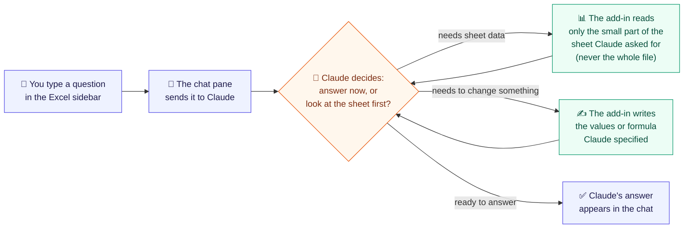

# Crunched KISS

An Excel task-pane agent for a four-hour take-home. You chat in the pane; Claude asks for workbook tools; Office.js is the only Excel runtime. Large sheets stay usable because the model sees addresses and samples, never a whole used range.

## Setup on a Mac

Prerequisites: Node 20–24, Python 3.12+, desktop Excel (Microsoft 365 / 16.x), and either [mkcert](https://github.com/FiloSottile/mkcert) or Microsoft’s `office-addin-dev-certs` (the setup script uses whichever is present).

```bash
# 1. API key at the repo root (never commit this file)
cp .env.example .env
# Edit .env and set ANTHROPIC_API_KEY=sk-ant-...

# 2. Trusted certs for Excel’s WebView (HTTPS only)
./scripts/setup-certs.sh

# 3. Backend — plain HTTP on 127.0.0.1:8000, no certificate flags
cd backend
python3 -m venv .venv && source .venv/bin/activate
pip install -r requirements.txt
cd ..
./scripts/dev-backend.sh

# 4. Add-in (second terminal)
cd frontend
npm install
npm run dev-server

# 5. Sideload into desktop Excel (third terminal, frontend/)
npm start
```

If `npm start` does not attach the pane, copy the manifest and restart Excel:

```bash
mkdir -p ~/Library/Containers/com.microsoft.Excel/Data/Documents/wef/
cp frontend/manifest.xml ~/Library/Containers/com.microsoft.Excel/Data/Documents/wef/
```

Then **Insert → Add-ins**, or look for **Crunched** on the Home tab.

The pane talks only to `https://localhost:3000`. Webpack proxies `/api/*` to the HTTP backend. Do not point Excel at port 8000.

## How it works (plain-language)



In short: you never hand Claude the spreadsheet file. You ask a question in the sidebar; Claude looks at only the small pieces of the sheet it actually needs (a sheet list, one range, a search result), reasons about them, optionally writes a value or formula back, and replies in plain English. This back-and-forth can repeat a few times per question, capped at 8 rounds so it can't loop forever. Every step Claude takes shows up as a small card in the thread, so nothing happens invisibly. That's also why it works on a spreadsheet with a million cells just as well as a small one — Claude is never shown more than a few thousand cells at a time.

## Architecture (technical)

```
Excel WebView  https://localhost:3000
  Chat UI  →  runAgent()  →  excel.ts (Office.js)
       │ fetch /api/chat
       ▼
webpack (HTTPS, trusted)  ──proxy──▶  uvicorn :8000 (HTTP, localhost)
                                          │
                                          ▼
                                    Anthropic tool-use
```

The agent loop lives in the pane because tools can only run inside Excel’s WebView. The backend is one stateless Claude turn: it returns `tool_calls` or a final `message`. There is a single HTTPS origin so the WebView does not need a second trusted certificate or CORS to uvicorn.

## Tools

`find` and the header preview are on `main` (issue #3). Each executed tool stays in the thread as a card (name + a short result) so the demo can point at `list_workbook_meta` or `write_range` without opening the network tab.

| Tool | Role |
|---|---|
| `list_workbook_meta` | Sheet names, used-range addresses, dimensions, and a first-row header preview |
| `read_range` | Values and formulas for one address; capped at 2,000 cells |
| `write_range` | Write a 2D values array; validated before `Excel.run` |
| `get_selection` | Active range plus a small preview |
| `find` | Locate a label; at most 50 addresses |

Hard cap: **8 tool rounds** per user send, then `force_text`.

## Any workbook size

The model never loads the book. It asks for **addresses and samples**.

- Call `list_workbook_meta` first (O(sheets), not O(cells)).
- Use `find` to locate labels, then `read_range` on a small block.
- Reads over 2,000 cells are truncated (or rejected) in the pane.
- After 8 tool rounds the pane forces a text reply.
- Generate a ~1M-cell fixture with `python3 scripts/make_big_workbook.py`. The xlsx is local and gitignored.

## Tests

```bash
cd backend && .venv/bin/pytest -q
cd frontend && npm test
```

These cover the HTTP contract, tool schemas, cell/history caps, and API paths. Office.js and the React pane only run inside Excel, so they are hand-checked in the live demo rather than mocked.

## Accessibility & readability

The pane is a narrow Excel WebView. This pass is for people who use a screen reader, a keyboard, or just need the type to be easier to read. The copper/ledger look stays.

**Screen reader.** The thread is a live log (`role="log"`) that announces new replies, tool cards, and status without re-reading the whole conversation. Send failures use `role="alert"`. Each tool card’s accessible name includes the summary (for example `Tool list_workbook_meta: Data 5000×200 · Budget 6×4`); errors are prefixed so color is not the only signal. Chat bubbles are headed You / Crunched. A skip link jumps past the masthead to the conversation. Markdown still renders as React elements, never `innerHTML`.

**Keyboard.** Every control is a real button or a labeled field. Tab order is skip link → New chat → suggested prompts → message → Send. Enter sends; Shift+Enter makes a new line. Focus rings use the existing copper outline, including New chat and the skip link.

**Reading comfort.** Body copy stays paper-on-ink. Muted labels and ledger/rust tool names were lightened so small type meets contrast. Chat bubbles, tool cards, chips, and the composer use a slightly larger size and looser line-height. The busy rule and spinner still yield to `prefers-reduced-motion`.

**Cleanup.** Accidental Finder copies (`backend/app/main 2.py`, `backend/tests/test_http 2.py`, `frontend/webpack 2.config.js`) are gitignored and are not part of the repo. Plan docs stay.

## What was cut

- Multi-tier Claude Code orchestrator as this product
- LangGraph, streaming, conversation persistence, auth, Vercel
- Reason / Agent Mode toggles
- Write-confirm dialogs (first real-user follow-up, not the interview bar)
- Excel Online as the primary host

## 15-minute demo

1. Open a large book (or `scripts/big.xlsx`). Ask how big it is. Point at the `list_workbook_meta` card that stays in the thread — not a full read of Data.
2. Error-check the Budget sheet. Show formulas and name the planted hard-coded cell and `#DIV/0!`.
3. Write one formula with `write_range` and show the cell.
4. Walk `agentClient.ts` (loop), `agent.py` (one turn), `tools.py` (contract). Excel never lives in Python.
5. Name what is deliberately missing.

## Time log

Honest, short: Hour 1 was sideload + HTTPS. Hour 2 was chat UI and Office.js wrappers. Hour 3 was the FastAPI tool-use contract and tests. After that: one-origin `/api` proxy (#2), then this README (#5) while #3/`find` and #4/fixture land on other worktrees.

## Layout

- `frontend/` — Office add-in. `excel.ts` is the only Office.js wrapper.
- `backend/app/agent.py` — the only LLM call.
- `backend/app/tools.py` — closed tool list and the 2,000-cell policy.
- `certs/` — webpack HTTPS pair (gitignored). Uvicorn is HTTP on localhost.
