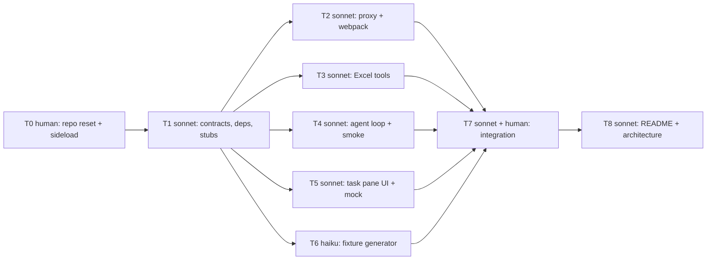

# Task index and launch order

Each `T<N>-*.md` file is a complete, self-contained prompt for a fresh Claude Code agent (model in the table). The
orchestrator (human, main Claude Code session) launches them in the order below, merges each branch into `main` after
its acceptance check, and never lets two agents edit the same file. Full design and schedule: `../PLAN.md`.
Shared verbatim assets used by the prompts: `assets/contracts.ts`, `assets/client.ts`, `assets/CLAUDE.md`, `assets/TIMELOG.md`.

## DAG



| id | file | model | est | depends on | owns (summary) | where it runs |
|---|---|---|---|---|---|---|
| T0 | `T0-repo-reset-and-sideload.md` | human | 25 | - | repo layout, `.env`, certs, sideload | main tree |
| T1 | `T1-contracts-and-stubs.md` | claude-sonnet-5 | 15 | T0 | `contracts.ts`, `client.ts`, stubs, `package.json`, vitest, tsconfig | main tree, alone |
| T2 | `T2-proxy-and-webpack.md` | claude-sonnet-5 | 25 | T1 | `webpack.config.js` | worktree `../ck-T2` |
| T3 | `T3-excel-tools.md` | claude-sonnet-5 | 55 | T1 | `src/excel/tools.ts`, `ranges.ts`, `ranges.test.ts` | worktree `../ck-T3` |
| T4 | `T4-agent-loop.md` | claude-sonnet-5 | 45 | T1 | `src/agent/loop.ts`, `systemPrompt.ts`, `history.ts`, tests, `scripts/agentSmoke.ts` | worktree `../ck-T4` (+ `.env`) |
| T5 | `T5-taskpane-ui.md` | claude-sonnet-5 | 45 | T1 | `src/taskpane/**` except `taskpane.html` | worktree `../ck-T5` |
| T6 | `T6-fixture-generator.md` | claude-haiku-4-5 | 15 | T1 | `scripts/make-fixture.mjs`, `fixtures/.gitkeep` | worktree `../ck-T6` |
| T7 | `T7-integration.md` | claude-sonnet-5 + human | 45 | T2-T6 merged | any file, bug fixes only | main tree, alone |
| T8 | `T8-readme-and-architecture.md` | claude-sonnet-5 | 25 | T7 | `README.md`, `docs/ARCHITECTURE.md` | main tree, alone |

## Exact launch order

1. **0:00** T0 by hand. Commit and push. `docs/TIMELOG.md` rows 1-2.
2. **0:15** Launch T1 in the main session (no worktree): "Execute the task in `docs/tasks/T1-contracts-and-stubs.md` exactly. Do not
   add instructions of your own." Model: claude-sonnet-5.
3. **0:30** Verify T1 (its Acceptance block), commit if the agent did not. Create worktrees from `main`:
   ```bash
   cd /Users/junseki/Documents/GitHub/crunched-kiss
   for t in T2 T3 T4 T5 T6; do
     git worktree add "../ck-$t" -b "task/$t" main
     ln -s "$PWD/node_modules" "../ck-$t/node_modules"      # fallback: (cd ../ck-$t && npm ci)
   done
   cp .env ../ck-T4/.env                                     # only T4 needs the key (npm run smoke)
   ```
   Launch, staggered so their reports do not all land at once: **T2 and T6 first** (short), then **T3 and T4**, then **T5** five minutes later.
   Each agent's prompt is the whole content of its task file plus one line: "Your working directory is `/Users/junseki/Documents/GitHub/ck-<id>`
   on branch `task/<id>`." Use your Claude Code client's subagent/worktree facility, or one terminal per worktree:
   ```bash
   cd ../ck-T3 && claude --model claude-sonnet-5 --permission-mode acceptEdits "$(cat ../crunched-kiss/docs/tasks/T3-excel-tools.md)"
   ```
   (T6 with `--model claude-haiku-4-5`.)
4. **Merge as each finishes**, in this order if two are ready at once: T6, T2, T4, T3, T5. For each:
   ```bash
   cd /Users/junseki/Documents/GitHub/crunched-kiss
   git diff --stat main..task/T3            # must list only the task's owned files
   git merge --no-ff task/T3 -m "Merge T3: Excel tools"
   npx tsc --noEmit -p tsconfig.json && npm test
   ```
   Then run the task's human-side acceptance (T6: `npm run fixture`; T2: `npm run stop; npm start` + curls + in-pane SDK check;
   T4: `npm run smoke`; T5: Safari `?mock=1`; T3: the Inspector tool gate). A red check blocks the next merge.
   Stray edits outside the owned files: `git checkout main -- <file>` before merging, and tell the agent.
5. **1:15-1:30 GATE**: all five merged, `npx webpack --mode development` green, all 7 tools return ok in the Inspector on the fixture.
6. **1:30** Launch T7 in the main session (sequential, may edit anything). Sit at Excel.
7. **2:00-2:15** When T7 reports, launch T8 with T7's final message appended to the prompt.
8. Cleanup when done: `git worktree remove ../ck-T2` (etc.) and `git branch -d task/T2` (etc.).

## Rules the orchestrator enforces at merge

- Only owned files changed (`git diff --stat`). `contracts.ts`, `client.ts`, `package.json` untouched by T2-T6.
- A `CONTRACT CHANGE REQUEST` in a final message is answered by the human editing `contracts.ts` on `main`, then
  telling the affected agents (usually only the requester) to rebase: `git rebase main` inside the worktree.
- Nobody but the human runs `npm start`/`npm run stop`.
- This repo is also pushed to from another session: `git pull --ff-only` on `main` before creating worktrees and before every merge.
